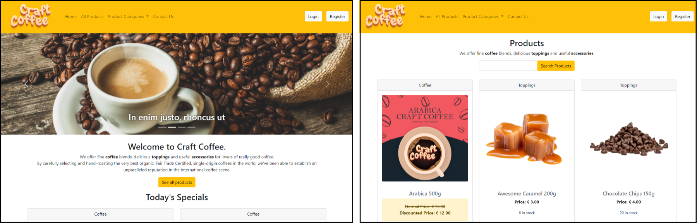
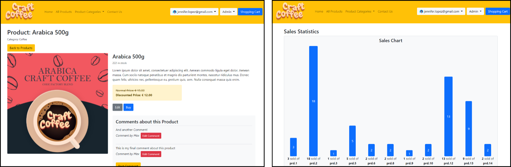
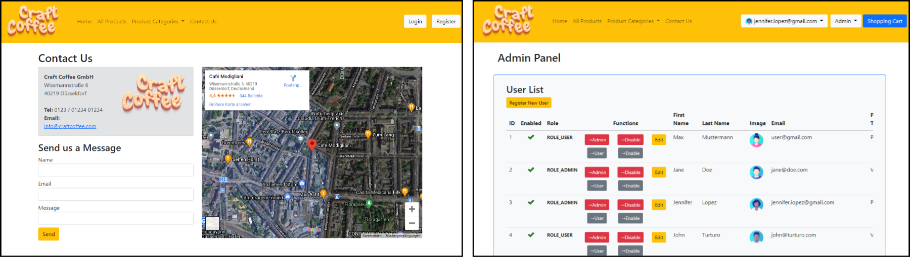
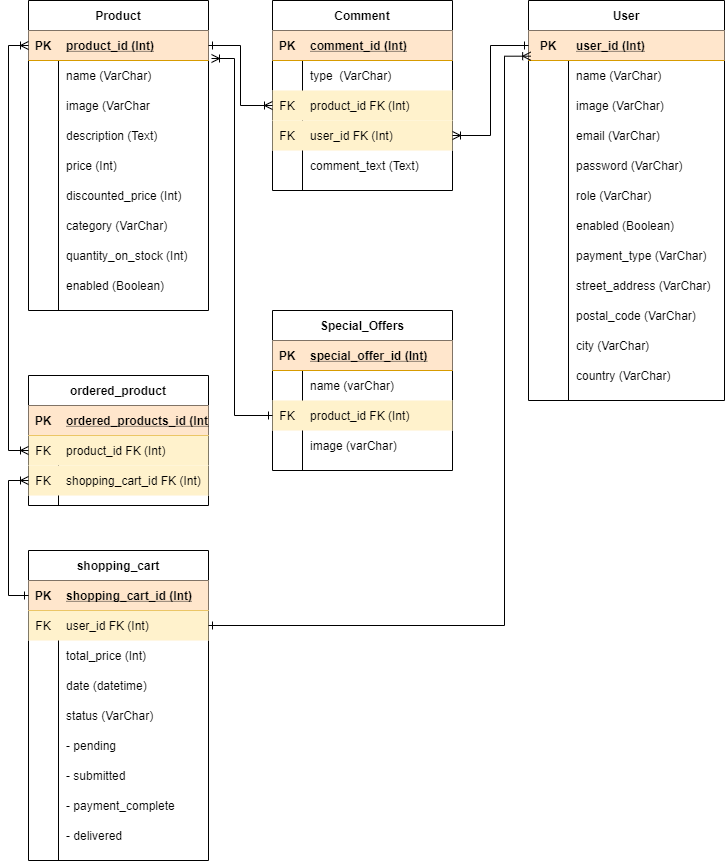
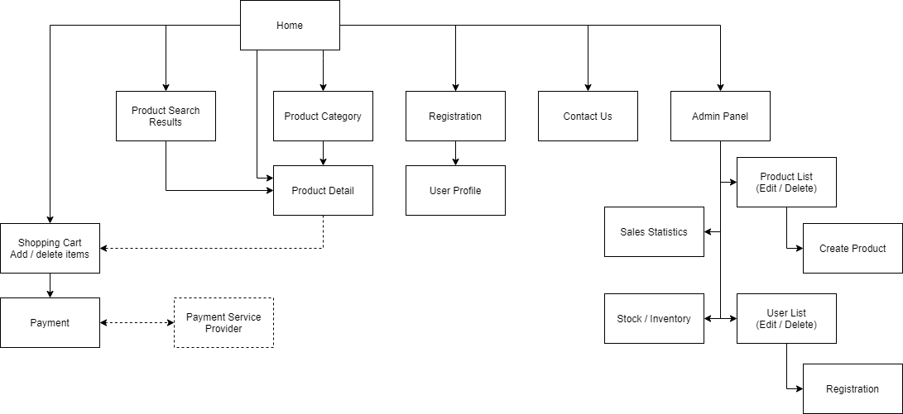
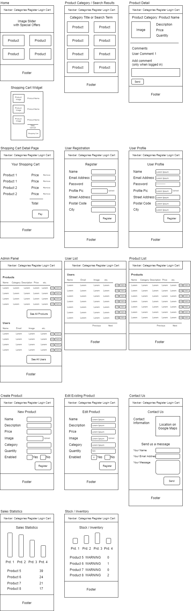

# CF11 Backend Team 6
Final project for the backend/fullstack at CodeFactory (CF11). The objective of this project is to develop an online store where customers can browse the product catalog and select the desired products. The selected items will be collected in a shopping cart. At checkout the items from the shopping cart will be displayed and the customer can pay the order. An email notification will be sent to the customer when the order is completed.

Please find the __project presentation__ here: https://docs.google.com/presentation/d/1VO5IWcyzsRifhF75ZxWzbHvwajaL8AGH55nt3FdD6xE/edit?usp=sharing

Please find the __Trello project plan__ here: https://trello.com/b/Et9sWbhm/craft-coffee-shop

## Team 6 Members
- Zuszana Stichova
- Robert Castillo
- Christian Frömmer
- Marin Balabanov

## Install
Clone the repository and import the DB export from the directory `db-export` into your MySQL database. Set the database path and user credentials in `.env`.

Run `composer install` (an additional `composer update` might be necessary).

To launch the webshop run `php bin/console server:run`

## Screenshots of Finished Shop

## Initial DB Structure

## Initial Site Structure

## Initial Wireframes

